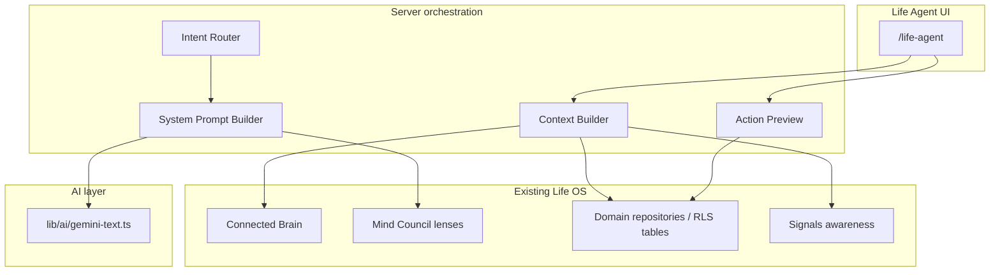
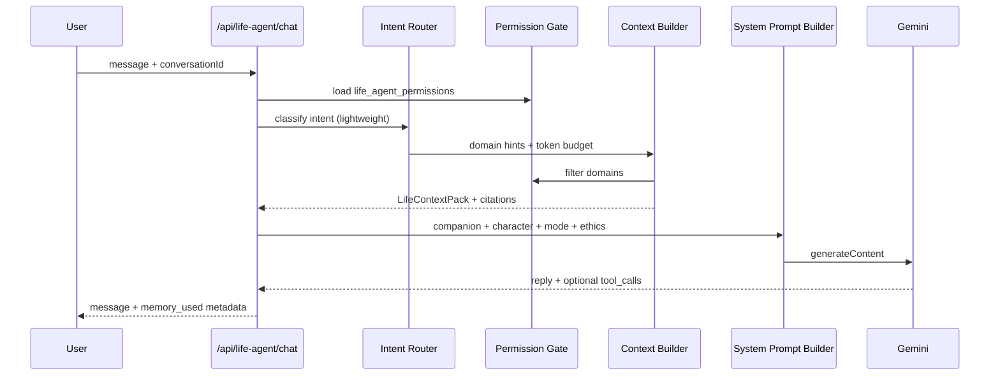

# Life Agent / Life Companion — System Architecture

> **Phase 0 — Architecture Lock**
> Status: planning only. No application code, UI, or migrations in this phase.
> Repo: `mybestlife-os` (`/Users/ouxianxing/My_life_os`)
> Last updated: 2026-05-30

---

## Executive summary

The **Life Companion** (internal codename: **Life Agent**) is an all-in-one AI orchestrator at the center of My Best Life OS. It is **not** a generic chatbot: it is a warm, character-based companion that understands the user’s **permitted** life context, helps them think / remember / decide / plan / act, and never bypasses RLS, permission boundaries, or explicit confirmation for writes.

Today the repo has strong **building blocks** but **no unified companion**:

| Capability | Existing module | Gap for Life Agent |
|------------|-----------------|-------------------|
| Cross-module graph | Connected Brain (`/brain`) | Graph-only; not chat context |
| Persona lenses | Mind Council (`/mind-council`) | Ephemeral client state; no DB |
| Grounded doc chat | Doc Oracle (`document_chat_*`) | Scoped to one knowledge document |
| KB assistant | `knowledge-assistant-context.ts` | Knowledge-only scoring pack |
| Domain micro-agents | `/api/ai/*` (tasks, habits, bio-lab, …) | Structured JSON; not conversational |
| External coach | AI Career Coach | Clipboard + external tab; no in-app LLM |
| Outward awareness | Signals (planned) | No companion integration yet |

Life Agent **composes** these patterns into one product surface with persistence, permissions, memory governance, and action previews.

---

## 1. Product definition

### What it is

An **AI character** that sits at the center of My Best Life OS, understands the user’s **permitted** life context, and helps them **think, remember, decide, plan, and act** — with warmth, emotional intelligence, and companion-like tone (not robotic corporate assistant).

### What it is not

- Not a replacement for therapy, legal, medical, or licensed financial advice
- Not an autonomous agent that sends messages, spends money, or edits data without confirmation
- Not a surveillance system that ingests everything silently
- Not Mind Council rebranded (lenses remain a **mode**, not the whole product)
- Not a dump of all Supabase rows into the model context window

### North-star feeling

> *"Someone who knows my life well enough to help me move forward today — and shows their work when they use my data."*

### Relationship to existing modules



**Mind Council** remains available at `/mind-council` for deep lens-only brainstorming. Life Agent can **invoke a lens** as `AgentModeSwitcher` → `mind_lens` without merging the two products.

**Connected Brain** supplies relationship hints and node summaries; Life Agent does not rebuild the graph.

---

## 2. Page / route plan

### Primary route

Follow existing App Router conventions:

```
app/src/app/[locale]/(protected)/life-agent/page.tsx
```

**Public URL:** `/{localeSlug}/life-agent`
Examples: `/en/life-agent`, `/zh-hk/life-agent`

### Secondary routes (later phases)

| Route | Purpose | Phase |
|-------|---------|-------|
| `/life-agent` | Main companion experience | 1 |
| `/life-agent/settings` | Permissions, memory, character | 3 |
| `/life-agent/memories` | Inspect / edit / delete memories | 3 |
| `/life-agent/history` | Conversation list (optional split) | 3 |

Prefer **query params for sub-views** where the repo already uses hub tabs (`?tab=permissions`, `?panel=brief`) — consistent with `/relationship?tab=`, `/resources?tab=`.

### Navigation placement

**Recommendation:** Command Center category, immediately after **Brain** and before **Daily Planner**.

Rationale:
- Positions Life Agent as the **orchestrator** next to the knowledge graph
- Separates it from Mind Council (Knowledge category) — companion ≠ lens library
- Matches “center of the OS” narrative

Update:
- `app/src/lib/constants/navigation.ts` — new `itemId: "life-agent"`
- `app/src/lib/i18n/nav-labels.ts` + `sidebar-ui.ts`
- `app/src/lib/supabase/middleware.ts` — add `/life-agent` to `protectedPrefixes`
  (**Note:** `/brain` and `/mind-council` are currently missing from `protectedPrefixes`; fix in Phase 1 shell work.)

### API routes

```
POST   /api/life-agent/chat              # streaming or JSON turn
GET    /api/life-agent/conversations     # list threads
GET    /api/life-agent/conversations/:id
DELETE /api/life-agent/conversations/:id
POST   /api/life-agent/action-preview    # propose write; no execution
POST   /api/life-agent/action-confirm    # execute approved preview
GET    /api/life-agent/context-preview   # debug: what would be sent (owner only)
PATCH  /api/life-agent/profile
PATCH  /api/life-agent/permissions
GET|PATCH /api/life-agent/memories
POST   /api/life-agent/upload            # multimodal attachments (phase 7)
```

Auth pattern: mirror `app/src/lib/knowledge/auth-guard.ts` and Mind Council routes — `createServerSupabaseClient()`, `getUser()`, distinguish `no_session` / `dev_bypass_only`.

---

## 3. Component architecture

Directory: `app/src/components/life-agent/`

### Page shell

| Component | Responsibility |
|-----------|----------------|
| `LifeAgentPage` | Server wrapper or client page; loads profile + permissions; `PageShell` / `ProtectedScrollLayout` |
| `LifeAgentHero` | Character greeting, today’s tone, quick check-in entry |
| `LifeAgentExperience` | Top-level client orchestrator (state, layout breakpoints) |

### Character system

| Component | Responsibility |
|-----------|----------------|
| `CharacterPicker` | Select preset companion archetype (Warm Guide, Steady Coach, …) |
| `CharacterAvatar` | Animated avatar; respects `useReducedMotion()` |
| `CompanionCheckIn` | Optional mood / energy / focus prompt (writes only on confirm) |

Reuse motion tokens from `app/src/lib/animation/easings.ts` and framer-motion patterns from `journal/`, `bio-lab/`.

### Conversation

| Component | Responsibility |
|-----------|----------------|
| `AgentConversation` | Message list, scroll, session switcher |
| `AgentMessage` | Role styling; badges for fact / memory / inference / suggestion |
| `AgentCommandBar` | Input, attach, mode chip, send; disabled while preview pending |
| `AgentModeSwitcher` | `companion` \| `planner` \| `reflect` \| `mind_lens` |

### Intelligence panels (right rail / bottom sheet on mobile)

| Component | Responsibility |
|-----------|----------------|
| `LifeBriefPanel` | Curated “what matters today” from permitted domains |
| `OpenLoopRadar` | Stale tasks, unanswered goals, pending reviews |
| `MemoryUsedPanel` | Transparent list of memories + context slices used in last turn |
| `LifeCoherencePanel` | Gentle alignment hints (goals ↔ tasks ↔ habits); no guilt language |
| `LifeChapterMap` | Timeline / chapter visualization (phase 8+) |
| `SuggestedWorkflowCards` | Deep links to existing modules (“Open in Tasks”, “Review in Journal”) |

### Safety & actions

| Component | Responsibility |
|-----------|----------------|
| `AgentActionPreview` | Diff-style preview of proposed DB changes |
| `AgentPermissionPanel` | Domain toggles; links to settings |
| `AgentDisclaimerBanner` | Persistent non-professional-advice disclaimer |

### Shared UI dependencies

- `components/ui/*` (shadcn): `button`, `dialog`, `sheet`, `scroll-area`, `glass-panel`
- `components/shared/`: `EmptyState`, `LoadingPage`, `slide-over-panel`
- i18n: `getLifeAgentUiCopy(locale)` in `lib/i18n/life-agent-ui.ts`

### State management

| Concern | Pattern |
|---------|---------|
| Conversations / messages | TanStack Query — `hooks/use-life-agent.ts` |
| Profile / permissions | React Query + `lib/repositories/life-agent.ts` |
| Optimistic UI | Only for non-destructive reads; **never** for writes |
| Streaming tokens | Local component state + `ReadableStream` consumer |

Do **not** use Zustand for chat (unlike Knowledge Base) — chat fits the dominant `repository + useQuery` pattern.

---

## 4. AI architecture

### Model provider abstraction

**Phase 1–6:** Extend existing `lib/ai/gemini-text.ts` only — no new provider package.

```ts
// lib/life-agent/ai/provider.ts
export type LifeAgentModelCall = {
  systemInstruction: string;
  contents: GeminiContent[];
  locale: AppLocale;
};

export async function invokeLifeAgentModel(
  call: LifeAgentModelCall,
): Promise<LifeAgentModelResult> { ... }
```

Future: interface allows `provider: "gemini" | "gateway"` behind env `LIFE_AGENT_MODEL=google/gemini-2.5-flash` (Vercel AI Gateway string) without client changes.

### Pipeline (per chat turn)



### Intent router

**Phase 4:** Start with **rules + keywords** (like `mind-council/recommend.ts`), not a separate LLM call.

Intents (initial):
- `reflect` — journal, feelings, meaning
- `plan` — tasks, calendar, daily planner
- `decide` — tradeoffs, priorities
- `remember` — recall facts, people, past entries
- `explore` — brainstorming; may suggest Mind Council handoff
- `act` — triggers action preview path only

Output: `{ intent, suggestedDomains[], suggestLensId?, confidence }`

### Context builder

New module: `lib/life-agent/context/`

| Module file | Role |
|-------------|------|
| `context-budget.ts` | Hard caps: ~8k–12k tokens context (configurable) |
| `domain-fetchers/*.ts` | Per-domain summarizers calling **repositories** server-side |
| `brain-summarizer.ts` | Top-N related nodes via `brain_edges` / embeddings |
| `pack-assembler.ts` | Merges slices; attaches `source_type`, `source_id`, `excerpt_hash` |
| `context-preview.ts` | Same output as chat, for settings/debug UI |

**Reuses:**
- Scoring ideas from `knowledge-assistant-context.ts` (query hints, recency boosts)
- Brain node IDs from `types/brain-graph.ts` taxonomy
- Locale output: `localeToGeminiLanguage` from `lib/i18n/gemini-locale.ts`

**Never:** `select *` from all tables. Each fetcher returns **summaries** (title, status, dates, 1–2 line excerpt).

### System prompt builder

`lib/life-agent/prompts/system.ts`

Layers (concatenated, ordered):
1. **Core companion contract** — warmth, boundaries, fact/memory/inference labeling
2. **Character layer** — from `life_agent_profiles.character_preset` + optional user tone notes
3. **Mode layer** — companion / planner / reflect / mind_lens
4. **Mind lens layer** (optional) — reuse `buildMindLensSystemInstruction` / `buildBundledLensSystemInstruction` ethics overrides
5. **Context pack** — structured markdown with citation IDs `[CTX:task:uuid]`
6. **Locale directive** — output language

### Action preview system

**Phase 5.** LLM may emit **structured action proposals** (Zod schema in `lib/life-agent/schemas/action-preview.ts`), validated server-side.

Flow:
1. Model returns `proposed_actions[]` in JSON block or tool call
2. Server persists row in `life_agent_action_previews` (status `pending`)
3. UI renders `AgentActionPreview` with human-readable diff
4. User confirms → `POST /api/life-agent/action-confirm` executes via **existing repositories** (same code paths as manual UI)
5. On success: preview → `confirmed`, message annotated with outcome

**Never** call Supabase `.insert()` directly from prompt output without schema validation + permission check.

### Memory-used metadata

Every assistant message stores:

```json
{
  "context_slices": [{ "domain": "tasks", "ids": ["..."], "label": "3 overdue tasks" }],
  "memories": [{ "id": "...", "kind": "preference", "excerpt": "..." }],
  "brain_nodes": [{ "id": "task:...", "title": "..." }],
  "inferences": ["You seem focused on career this week"]
}
```

UI: `MemoryUsedPanel` — tap to open source record (deep link).

### Failure states

| State | Behavior |
|-------|----------|
| Missing `GEMINI_API_KEY` | Placeholder markdown (Mind Council pattern) + banner |
| Rate limit / 5xx | Retry chain via `getGeminiPlannerTextModelChain()` |
| Context empty (permissions off) | Companion responds with transparency; suggests enabling domain |
| Action preview invalid | Reject preview; no partial writes |

---

## 5. Permission architecture

### Domain enum

Aligned with user-facing Life OS modules + graph:

| Domain key | Maps to |
|------------|---------|
| `about_me` | `about_me` |
| `projects` | `projects` |
| `tasks` | `tasks`, `task_subtasks` |
| `goals` | `goals`, `key_results` |
| `habits` | `habits`, `routines` (add domain; was in product brief) |
| `relationships` | `relationships` |
| `role_models` | `role_models` |
| `assets` | `assets` |
| `documents` | `documents` |
| `notes` | `notes` |
| `journal` | `journal_entries` |
| `bucket_list` | `bucket_items` |
| `knowledge_base` | `knowledge_items` (+ connections) |
| `finance` | `finance_*` tables |
| `health` | `health_daily_logs`, `health_metrics`, `health_goals` |
| `brain_graph` | `brain_edges`, `brain_relations`, summaries only |
| `signals` | `signal_items` (when integrated) |

**Mind Council** is not a data domain — it is a **mode** that changes style, not row access.

### Access levels

| Level | Code | Context in prompt | Model may propose writes |
|-------|------|-------------------|--------------------------|
| Off | `off` | None | No |
| Ask every time | `ask_every_time` | Only after per-turn user approval in UI | Preview only after approval |
| Read only | `read_only` | Summaries | No |
| Suggest actions | `suggest_actions` | Summaries | Preview cards; user confirms |
| Act with confirmation | `act_with_confirmation` | Summaries | Same as suggest (no silent auto-write) |

**Important:** `act_with_confirmation` does **not** mean auto-execute. It means the companion may **prepare** actions quickly; execution still requires confirm button.

Default for new users: all domains `read_only` except `about_me` → `suggest_actions` (user can tighten in onboarding).

Storage: `life_agent_permissions` (see data model doc).

---

## 6. Memory architecture

### Memory kinds

| Kind | Source | Trust | User can edit |
|------|--------|-------|---------------|
| `identity` | About Me, explicit profile | High | Yes |
| `preference` | User-stated in chat (“I prefer mornings”) | High if confirmed | Yes |
| `active_context` | Derived from open tasks/goals (TTL 7d) | Medium | Dismiss |
| `relationship` | Relationships module + confirmed notes | High | Yes |
| `resource` | Assets, documents, KB links | High | Yes |
| `reflection` | Journal themes (with consent) | Medium | Yes |
| `life_chapter` | User-named periods | High | Yes |
| `user_confirmed` | Explicit “remember this” | High | Yes |
| `inferred` | Model suggestion | Low | Confirm or delete |

### Lifecycle

1. **Create:** User says “remember …” → preview memory card → confirm → `life_agent_memories` with `source: user_confirmed`
2. **Infer:** Model proposes → `status: pending` until user accepts
3. **Expire:** `active_context` auto-expires; cron or lazy delete
4. **Inspect:** `/life-agent/memories` or panel in settings
5. **Delete:** Hard delete + remove from future context packs (tombstone flag)

### Prompt inclusion rules

- Max **20** memory bullets per turn, ranked by recency + relevance score
- Always label in system prompt: `MEMORY (user-confirmed): …` vs `MEMORY (inferred, unconfirmed): …`
- Inferred unconfirmed memories **must not** be stated as facts

---

## 7. Safety / privacy architecture

Non-negotiable rules (expanded in `life-agent-ai-policy.md`):

1. **No hidden surveillance** — context usage visible in `MemoryUsedPanel`
2. **No unapproved writes** — all mutations via action preview + confirm
3. **No automatic outbound messages** — email, SMS, calendar invites forbidden in v1
4. **No uncontrolled prompt dumping** — context budget enforced in code
5. **No manipulation** — no guilt, urgency manufactured for engagement
6. **No professional impersonation** — companion ≠ therapist / lawyer / doctor / CFP
7. **Label epistemic status** — fact vs memory vs inference vs suggestion in UI badges
8. **RLS always** — server uses user session; service role only for batch jobs with explicit scope
9. **Export / delete** — user can delete conversations and memories (GDPR-aligned)
10. **Degrade gracefully** — deterministic Life Brief from DB queries works without Gemini

---

## 8. Integration map (existing code to reuse)

| Need | Reuse from |
|------|------------|
| Gemini chat | `fetchGeminiChatText` in `lib/ai/gemini-text.ts` |
| Lens ethics | `lib/mind-council/skill-runtime.ts`, `load-bundled-skill.ts` |
| Context scoring | `lib/knowledge/knowledge-assistant-context.ts` |
| Chat persistence pattern | `document_chat_sessions` / `document_chat_messages` |
| Graph context | `lib/brain/buildBrainData.ts`, `use-brain-queries.ts` patterns server-side |
| Auth | `lib/supabase/server.ts`, `knowledge/auth-guard.ts` |
| i18n | `lib/i18n/copy-helpers.ts`, `get*UiCopy` pattern |
| Writes | `lib/repositories/*.ts` per domain |
| Preferences row | Extend `user_ai_preferences` **or** keep separate `life_agent_profiles` (recommended separate) |

---

## 9. Unresolved questions (for Phase 1 kickoff)

| # | Question | Recommendation |
|---|----------|----------------|
| 1 | Product name in UI: “Life Agent” vs “Life Companion”? | **Life Companion** user-facing; `life-agent` route slug for stability |
| 2 | Streaming vs full JSON response? | **Streaming** for chat UX; match Doc Oracle if already streaming |
| 3 | Single conversation vs multiple threads? | **Multiple threads** from day one (DB supports it) |
| 4 | Merge Mind Council into Life Agent? | **No** — link out; optional lens mode |
| 5 | Character presets: how many? | Start with **4** archetypes + custom tone field |
| 6 | Should Signals feed Life Brief? | **Yes**, phase 6; read-only domain |
| 7 | Fix `/brain` middleware gap? | **Yes** in Phase 1 |
| 8 | Multimodal: which buckets? | New `life-agent-attachments` bucket; follow `{userId}/…` pattern |

---

## 10. Phase 10 — Production hardening (implemented)

| Layer | Mechanism |
|-------|-----------|
| **Actions** | Zod validation → preview row → user confirm → atomic claim → executor → `executed`/`failed`; 24h preview TTL |
| **Context** | Per-domain caps in `LIFE_AGENT_CONTEXT_CAPS`; global context/system truncation in `prompt-budget.ts` |
| **Chat** | Max 50 messages per history fetch; 10 turn window; missing API key → honest fallback message (not fake success) |
| **Permissions** | `off` excluded from pack; `read_only` no previews; `ask_every_time` needs session grant |
| **RLS** | All `life_agent_*` tables owner-scoped; private upload bucket |
| **UI** | Calm arrival mode; memory-used panel; action review drawer; reduced motion on avatar + thinking |

See [life-agent-testing-checklist.md](./life-agent-testing-checklist.md) for manual QA.

---

## 11. Related documents

- [life-agent-implementation-roadmap.md](./life-agent-implementation-roadmap.md) — phases, testing, acceptance
- [life-agent-data-model.md](./life-agent-data-model.md) — tables, RLS, indexes
- [life-agent-ai-policy.md](./life-agent-ai-policy.md) — prompts, safety, labeling
- [life-agent-testing-checklist.md](./life-agent-testing-checklist.md) — manual + automated QA matrix
