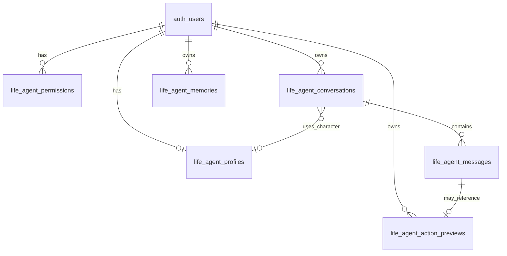

# Life Agent — Data Model

> **Phase 0 — Architecture Lock**
> No migrations in this phase. This document specifies the **planned** schema for Phase 2+.
> Conventions follow `app/supabase/migrations/` patterns (owner RLS, `user_id`, per-op policies on newer tables).

---

## Design principles

1. **User-owned rows** — `user_id UUID NOT NULL REFERENCES auth.users(id) ON DELETE CASCADE DEFAULT auth.uid()`
2. **RLS on every table** — `auth.uid() = user_id` (split SELECT/INSERT/UPDATE/DELETE for new tables)
3. **No service-role from client** — companion APIs use session client only
4. **JSONB for evolving metadata** — `metadata`, `memory_used`, `action_payload` with app-level Zod validation
5. **Idempotent migrations** — `DROP POLICY IF EXISTS`, `CREATE TABLE IF NOT EXISTS`
6. **TypeScript mirror** — extend `app/src/types/database.ts` after migration lands

---

## Entity relationship overview



---

## Table: `life_agent_profiles`

One row per user (companion identity).

| Column | Type | Notes |
|--------|------|-------|
| `user_id` | `UUID PK` | FK → `auth.users` |
| `character_preset` | `TEXT NOT NULL` | e.g. `warm_guide`, `steady_coach`, `curious_friend`, `calm_anchor` |
| `character_display_name` | `TEXT` | User override; nullable |
| `tone_notes` | `TEXT` | Optional user guidance (“be brief”, “more playful”) |
| `preferred_mode` | `TEXT NOT NULL DEFAULT 'companion'` | `companion`, `planner`, `reflect` |
| `active_lens_id` | `TEXT` | Mind Council skill id when in lens mode; nullable |
| `onboarding_completed_at` | `TIMESTAMPTZ` | First-run wizard |
| `last_check_in_at` | `TIMESTAMPTZ` | Companion check-in |
| `metadata` | `JSONB NOT NULL DEFAULT '{}'` | Feature flags, avatar variant |
| `created_at` | `TIMESTAMPTZ NOT NULL DEFAULT now()` | |
| `updated_at` | `TIMESTAMPTZ NOT NULL DEFAULT now()` | touch trigger |

**Indexes:** PK only (`user_id`)

**RLS:** Single policy or split CRUD — `USING (auth.uid() = user_id)`

---

## Table: `life_agent_permissions`

One row per `(user_id, domain)`.

| Column | Type | Notes |
|--------|------|-------|
| `id` | `UUID PK DEFAULT gen_random_uuid()` | |
| `user_id` | `UUID NOT NULL` | FK → `auth.users` |
| `domain` | `TEXT NOT NULL` | See domain enum below |
| `access_level` | `TEXT NOT NULL` | `off`, `ask_every_time`, `read_only`, `suggest_actions`, `act_with_confirmation` |
| `updated_at` | `TIMESTAMPTZ NOT NULL DEFAULT now()` | |

**Unique:** `(user_id, domain)`

**Indexes:**
- `life_agent_permissions_user_domain_uidx` UNIQUE `(user_id, domain)`
- `life_agent_permissions_user_idx` `(user_id)`

**Domain check constraint:**

```sql
CHECK (domain IN (
  'about_me', 'projects', 'tasks', 'goals', 'habits',
  'relationships', 'role_models', 'assets', 'documents',
  'notes', 'journal', 'bucket_list', 'knowledge_base',
  'finance', 'health', 'brain_graph', 'signals'
))
```

```sql
CHECK (access_level IN (
  'off', 'ask_every_time', 'read_only', 'suggest_actions', 'act_with_confirmation'
))
```

**RLS:** Per-operation policies (match `document_chat_sessions` style)

**Seed on profile create:** Insert 17 rows with safe defaults (`read_only`; `about_me` → `suggest_actions`)

---

## Table: `life_agent_conversations`

| Column | Type | Notes |
|--------|------|-------|
| `id` | `UUID PK DEFAULT gen_random_uuid()` | |
| `user_id` | `UUID NOT NULL` | |
| `title` | `TEXT` | Auto from first message or user rename |
| `mode` | `TEXT NOT NULL DEFAULT 'companion'` | Snapshot of mode when created |
| `character_preset` | `TEXT` | Snapshot for history display |
| `active_lens_id` | `TEXT` | Nullable |
| `is_pinned` | `BOOLEAN NOT NULL DEFAULT false` | |
| `last_message_at` | `TIMESTAMPTZ` | Denormalized for sort |
| `metadata` | `JSONB NOT NULL DEFAULT '{}'` | |
| `created_at` | `TIMESTAMPTZ NOT NULL DEFAULT now()` | |
| `updated_at` | `TIMESTAMPTZ NOT NULL DEFAULT now()` | |

**Indexes:**
- `life_agent_conversations_user_updated_idx` `(user_id, last_message_at DESC NULLS LAST)`
- `life_agent_conversations_user_pinned_idx` `(user_id, is_pinned, updated_at DESC)`

**RLS:** Owner-only CRUD

---

## Table: `life_agent_messages`

| Column | Type | Notes |
|--------|------|-------|
| `id` | `UUID PK DEFAULT gen_random_uuid()` | |
| `user_id` | `UUID NOT NULL` | Denormalized for RLS simplicity |
| `conversation_id` | `UUID NOT NULL` | FK → `life_agent_conversations(id) ON DELETE CASCADE` |
| `role` | `TEXT NOT NULL` | `user`, `assistant`, `system` |
| `content` | `TEXT NOT NULL` | Markdown |
| `epistemic_tags` | `JSONB NOT NULL DEFAULT '[]'` | `fact`, `memory`, `inference`, `suggestion` spans |
| `memory_used` | `JSONB NOT NULL DEFAULT '{}'` | Context + memory citation payload |
| `context_pack_hash` | `TEXT` | Hash of context slice for audit/debug |
| `model_id` | `TEXT` | Which Gemini model answered |
| `token_estimate` | `INTEGER` | Optional telemetry |
| `created_at` | `TIMESTAMPTZ NOT NULL DEFAULT now()` | |

**Indexes:**
- `life_agent_messages_conversation_created_idx` `(conversation_id, created_at)`
- `life_agent_messages_user_created_idx` `(user_id, created_at DESC)` — for export

**RLS:** Owner-only; INSERT must match conversation owner (trigger optional)

**Trigger (recommended):** On INSERT message → update `life_agent_conversations.last_message_at`, `updated_at`

**CHECK:**

```sql
CHECK (role IN ('user', 'assistant', 'system'))
```

---

## Table: `life_agent_memories`

| Column | Type | Notes |
|--------|------|-------|
| `id` | `UUID PK DEFAULT gen_random_uuid()` | |
| `user_id` | `UUID NOT NULL` | |
| `kind` | `TEXT NOT NULL` | See memory kinds in architecture doc |
| `content` | `TEXT NOT NULL` | Canonical memory text |
| `source` | `TEXT NOT NULL` | `user_confirmed`, `inferred`, `imported`, `system` |
| `status` | `TEXT NOT NULL DEFAULT 'active'` | `pending`, `active`, `archived`, `deleted` |
| `source_domain` | `TEXT` | Optional link to domain |
| `source_entity_type` | `TEXT` | e.g. `task`, `journal_entry` |
| `source_entity_id` | `UUID` | Nullable FK to source row |
| `confidence` | `REAL` | 0–1 for inferred |
| `expires_at` | `TIMESTAMPTZ` | For `active_context` TTL |
| `metadata` | `JSONB NOT NULL DEFAULT '{}'` | |
| `created_at` | `TIMESTAMPTZ NOT NULL DEFAULT now()` | |
| `updated_at` | `TIMESTAMPTZ NOT NULL DEFAULT now()` | |

**Indexes:**
- `life_agent_memories_user_status_idx` `(user_id, status)` WHERE `status = 'active'`
- `life_agent_memories_user_kind_idx` `(user_id, kind)`
- `life_agent_memories_expires_idx` `(expires_at)` WHERE `expires_at IS NOT NULL`

**CHECK:**

```sql
CHECK (kind IN (
  'identity', 'preference', 'active_context', 'relationship',
  'resource', 'reflection', 'life_chapter', 'user_confirmed', 'inferred'
))
```

```sql
CHECK (source IN ('user_confirmed', 'inferred', 'imported', 'system'))
```

```sql
CHECK (status IN ('pending', 'active', 'archived', 'deleted'))
```

**RLS:** Owner-only CRUD

---

## Table: `life_agent_action_previews`

| Column | Type | Notes |
|--------|------|-------|
| `id` | `UUID PK DEFAULT gen_random_uuid()` | |
| `user_id` | `UUID NOT NULL` | |
| `conversation_id` | `UUID` | FK nullable SET NULL |
| `message_id` | `UUID` | FK → messages nullable |
| `domain` | `TEXT NOT NULL` | Target domain |
| `action_type` | `TEXT NOT NULL` | `create`, `update`, `delete`, `link` |
| `target_table` | `TEXT NOT NULL` | e.g. `tasks` |
| `target_id` | `UUID` | Null for create |
| `preview_title` | `TEXT NOT NULL` | Human-readable |
| `preview_summary` | `TEXT` | |
| `payload` | `JSONB NOT NULL` | Validated patch body |
| `payload_hash` | `TEXT NOT NULL` | Detect tampering between preview and confirm |
| `status` | `TEXT NOT NULL DEFAULT 'pending'` | `pending`, `confirmed`, `rejected`, `expired`, `failed` |
| `confirmed_at` | `TIMESTAMPTZ` | |
| `execution_result` | `JSONB` | Success/error after confirm |
| `expires_at` | `TIMESTAMPTZ NOT NULL` | Default now() + 30 minutes |
| `created_at` | `TIMESTAMPTZ NOT NULL DEFAULT now()` | |

**Indexes:**
- `life_agent_action_previews_user_status_idx` `(user_id, status)`
- `life_agent_action_previews_pending_expires_idx` `(expires_at)` WHERE `status = 'pending'`

**CHECK:**

```sql
CHECK (action_type IN ('create', 'update', 'delete', 'link'))
```

```sql
CHECK (status IN ('pending', 'confirmed', 'rejected', 'expired', 'failed'))
```

**RLS:** Owner-only; UPDATE to `confirmed` only via API route that re-validates `payload_hash`

---

## Optional Phase 7+: `life_agent_attachments`

| Column | Type | Notes |
|--------|------|-------|
| `id` | `UUID PK` | |
| `user_id` | `UUID NOT NULL` | |
| `conversation_id` | `UUID NOT NULL` | |
| `message_id` | `UUID` | Set after message created |
| `storage_path` | `TEXT NOT NULL` | `{userId}/{conversationId}/{uuid}` |
| `mime_type` | `TEXT NOT NULL` | |
| `size_bytes` | `INTEGER NOT NULL` | |
| `metadata` | `JSONB` | Transcript, image dims |
| `created_at` | `TIMESTAMPTZ` | |

**Storage bucket:** `life-agent-attachments` (private; RLS folder = user id)

---

## RLS policy strategy (template)

For each new table `life_agent_*`:

```sql
ALTER TABLE public.life_agent_conversations ENABLE ROW LEVEL SECURITY;

DROP POLICY IF EXISTS life_agent_conversations_select_own ON public.life_agent_conversations;
CREATE POLICY life_agent_conversations_select_own
  ON public.life_agent_conversations FOR SELECT TO authenticated
  USING (auth.uid() = user_id);

-- repeat INSERT, UPDATE, DELETE
```

**Child table integrity:** Optional trigger `life_agent_messages_assert_conversation_owner` — on INSERT, verify `conversation_id` belongs to `auth.uid()`.

**No cross-user reads** — even for “household” features (out of scope v1).

---

## Repository layer (planned)

`app/src/lib/repositories/life-agent.ts`:

| Method | Table(s) |
|--------|----------|
| `getProfile()` / `upsertProfile()` | `life_agent_profiles` |
| `listPermissions()` / `upsertPermission()` | `life_agent_permissions` |
| `listConversations()` / `createConversation()` / `deleteConversation()` | `life_agent_conversations` |
| `listMessages(conversationId)` / `appendMessage()` | `life_agent_messages` |
| `listMemories()` / `createMemory()` / `updateMemory()` / `deleteMemory()` | `life_agent_memories` |
| `createActionPreview()` / `confirmActionPreview()` | `life_agent_action_previews` |

Hooks: `app/src/hooks/use-life-agent.ts` — TanStack Query keys `["life-agent", "conversations"]`, etc.

---

## Migration file naming (when implemented)

```
app/supabase/migrations/20271001000000_life_agent_foundation.sql
```

Single migration for all six core tables + RLS + triggers + permission seed function.

---

## Relationship to existing tables

| Existing | Relationship |
|----------|--------------|
| `user_ai_preferences` | **Separate concern** (external AI tool defaults). Life Agent uses `life_agent_profiles`. Optional: add `life_agent_enabled BOOLEAN` later. |
| `document_chat_*` | **Do not merge** — document-scoped RAG stays separate |
| `brain_*` | Read-only via context builder; no FK |
| Domain tables (`tasks`, etc.) | Referenced by `source_entity_id` in memories and action previews |

---

## Data retention

| Data | Default retention |
|------|-------------------|
| Conversations | Until user deletes |
| Messages | Cascade delete with conversation |
| Pending action previews | Auto-expire 30 min |
| Inferred memories (`pending`) | Expire 14 days if not confirmed |
| `active_context` memories | `expires_at` 7 days |

User setting (phase 8): “Delete conversations older than N days” — cron or on-login job.
