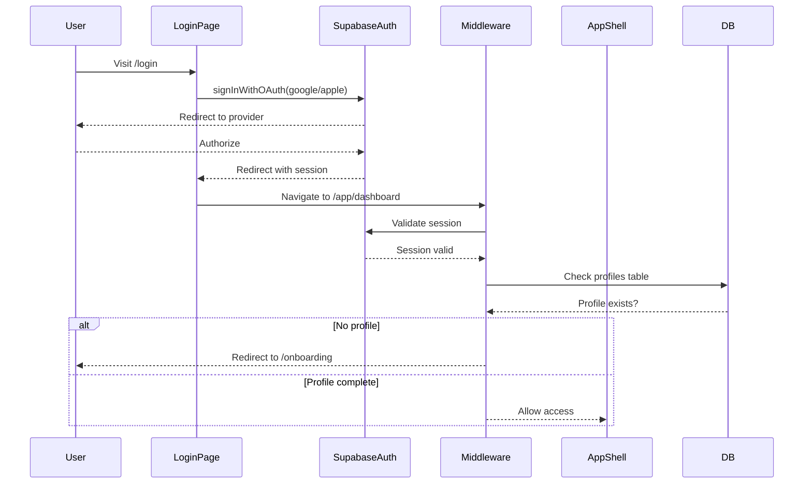

# MyLifeOS Auth and Supabase Strategy

## Architecture Overview

```
┌─────────────────────────────────────────────────────────────────┐
│                        Client (Next.js)                         │
│                                                                 │
│  ┌──────────┐  ┌──────────────┐  ┌───────────────────────────┐ │
│  │  Pages    │  │  React Query │  │  Zustand (client state)   │ │
│  │  (UI)     │──│  (server     │  │  - UI state               │ │
│  │          │  │   state)     │  │  - filters, view modes    │ │
│  └──────────┘  └──────┬───────┘  └───────────────────────────┘ │
│                       │                                         │
│              ┌────────▼────────┐                                │
│              │  Service Layer  │                                │
│              │  (per-domain)   │                                │
│              └────────┬────────┘                                │
│                       │                                         │
│              ┌────────▼────────┐                                │
│              │ Repository Layer│                                │
│              │ (Supabase client│                                │
│              │  operations)    │                                │
│              └────────┬────────┘                                │
│                       │                                         │
├───────────────────────┼─────────────────────────────────────────┤
│                       │           Supabase                      │
│              ┌────────▼────────┐                                │
│              │   Supabase Auth │  Google OAuth, Apple Sign-In   │
│              └────────┬────────┘                                │
│              ┌────────▼────────┐                                │
│              │   PostgreSQL    │  41 tables with RLS            │
│              └────────┬────────┘                                │
│              ┌────────▼────────┐                                │
│              │   Storage       │  Images, files, audio          │
│              └────────┬────────┘                                │
│              ┌────────▼────────┐                                │
│              │  Edge Functions │  AI actions (29+)              │
│              └─────────────────┘                                │
└─────────────────────────────────────────────────────────────────┘
```

---

## Authentication

### Provider Setup

**Google OAuth:**
- Configure in Supabase Dashboard > Authentication > Providers
- Google Cloud Console: Create OAuth 2.0 credentials
- Redirect URL: `https://<project>.supabase.co/auth/v1/callback`
- Scopes: `email`, `profile`, optionally `calendar` (for Google Calendar integration)

**Apple Sign-In:**
- Configure in Supabase Dashboard > Authentication > Providers
- Apple Developer Portal: Create Service ID, configure domains
- Redirect URL: `https://<project>.supabase.co/auth/v1/callback`

### Auth Flow



### Session Management

```typescript
// lib/supabase/middleware.ts
// Next.js middleware for session refresh and route protection

// Protected routes: /app/*
// Public routes: /, /login, /signup, /onboarding, /auth/callback

// On every request to /app/*:
// 1. Get session from Supabase
// 2. If no session, redirect to /login
// 3. If session exists, refresh token if needed
// 4. Pass user context to server components
```

### Route Structure

```
/ .......................... Marketing/landing page (public)
/login ..................... Login page with OAuth buttons (public)
/auth/callback ............. OAuth callback handler (public)
/onboarding ................ New user onboarding flow (authenticated, no profile required)
/app ....................... App shell redirect to dashboard (protected)
/app/dashboard ............. Dashboard (protected)
/app/tasks ................. Tasks (protected)
/app/projects .............. Projects (protected)
/app/daily-planner ......... Daily Planner (protected)
/app/goals ................. Goals (protected)
/app/notes ................. Notes (protected)
/app/journal ............... Journal (protected)
... (all other feature pages under /app/*)
/app/settings .............. Settings (protected)
```

### Client-Side Auth Hook

```typescript
// hooks/useAuth.ts
interface AuthContext {
  user: User | null;
  profile: Profile | null;
  isLoading: boolean;
  signInWithGoogle: () => Promise<void>;
  signInWithApple: () => Promise<void>;
  signOut: () => Promise<void>;
}
```

---

## Database Schema

### Core Tables

#### profiles

```sql
CREATE TABLE profiles (
  id UUID PRIMARY KEY REFERENCES auth.users(id) ON DELETE CASCADE,
  email TEXT,
  full_name TEXT,
  avatar_url TEXT,
  language TEXT DEFAULT 'en' CHECK (language IN ('en', 'zh-TW')),
  timezone TEXT DEFAULT 'UTC',
  theme TEXT DEFAULT 'light' CHECK (theme IN ('light', 'dark')),
  onboarding_completed BOOLEAN DEFAULT false,
  created_at TIMESTAMPTZ DEFAULT now(),
  updated_at TIMESTAMPTZ DEFAULT now()
);
```

#### projects

```sql
CREATE TABLE projects (
  id UUID PRIMARY KEY DEFAULT gen_random_uuid(),
  user_id UUID REFERENCES auth.users(id) ON DELETE CASCADE NOT NULL,
  name TEXT NOT NULL,
  description TEXT,
  status TEXT DEFAULT 'planning' CHECK (status IN ('planning', 'active', 'paused', 'completed', 'cancelled')),
  priority TEXT DEFAULT 'medium' CHECK (priority IN ('low', 'medium', 'high', 'urgent')),
  start_date DATE,
  end_date DATE,
  color TEXT,
  tags TEXT[],
  created_at TIMESTAMPTZ DEFAULT now(),
  updated_at TIMESTAMPTZ DEFAULT now()
);
```

#### tasks

```sql
CREATE TABLE tasks (
  id UUID PRIMARY KEY DEFAULT gen_random_uuid(),
  user_id UUID REFERENCES auth.users(id) ON DELETE CASCADE NOT NULL,
  project_id UUID REFERENCES projects(id) ON DELETE SET NULL,
  title TEXT NOT NULL,
  description TEXT,
  status TEXT DEFAULT 'todo' CHECK (status IN ('todo', 'in-progress', 'done', 'cancelled')),
  priority TEXT DEFAULT 'medium' CHECK (priority IN ('low', 'medium', 'high', 'urgent')),
  due_date DATE,
  completed_at TIMESTAMPTZ,
  estimated_blocks INTEGER,
  tags TEXT[],
  source TEXT,
  source_url TEXT,
  reminder_date TIMESTAMPTZ,
  created_at TIMESTAMPTZ DEFAULT now(),
  updated_at TIMESTAMPTZ DEFAULT now()
);
```

#### goals

```sql
CREATE TABLE goals (
  id UUID PRIMARY KEY DEFAULT gen_random_uuid(),
  user_id UUID REFERENCES auth.users(id) ON DELETE CASCADE NOT NULL,
  name TEXT NOT NULL,
  description TEXT,
  status TEXT DEFAULT 'active' CHECK (status IN ('active', 'completed', 'paused', 'cancelled')),
  target_date DATE,
  category TEXT,
  created_at TIMESTAMPTZ DEFAULT now(),
  updated_at TIMESTAMPTZ DEFAULT now()
);
```

#### key_results

```sql
CREATE TABLE key_results (
  id UUID PRIMARY KEY DEFAULT gen_random_uuid(),
  user_id UUID REFERENCES auth.users(id) ON DELETE CASCADE NOT NULL,
  goal_id UUID REFERENCES goals(id) ON DELETE CASCADE NOT NULL,
  name TEXT NOT NULL,
  target_value NUMERIC,
  current_value NUMERIC DEFAULT 0,
  unit TEXT,
  created_at TIMESTAMPTZ DEFAULT now(),
  updated_at TIMESTAMPTZ DEFAULT now()
);
```

#### daily_plans

```sql
CREATE TABLE daily_plans (
  id UUID PRIMARY KEY DEFAULT gen_random_uuid(),
  user_id UUID REFERENCES auth.users(id) ON DELETE CASCADE NOT NULL,
  plan_date DATE NOT NULL,
  start_time TEXT NOT NULL,
  end_time TEXT NOT NULL,
  tasks JSONB DEFAULT '[]',
  schedule_image_url TEXT,
  template_id UUID REFERENCES schedule_templates(id) ON DELETE SET NULL,
  created_at TIMESTAMPTZ DEFAULT now(),
  updated_at TIMESTAMPTZ DEFAULT now(),
  UNIQUE(user_id, plan_date)
);
```

#### notes

```sql
CREATE TABLE notes (
  id UUID PRIMARY KEY DEFAULT gen_random_uuid(),
  user_id UUID REFERENCES auth.users(id) ON DELETE CASCADE NOT NULL,
  project_id UUID REFERENCES projects(id) ON DELETE SET NULL,
  title TEXT NOT NULL,
  content TEXT,
  category TEXT,
  tags TEXT[],
  is_favorite BOOLEAN DEFAULT false,
  created_at TIMESTAMPTZ DEFAULT now(),
  updated_at TIMESTAMPTZ DEFAULT now()
);
```

#### journal_entries

```sql
CREATE TABLE journal_entries (
  id UUID PRIMARY KEY DEFAULT gen_random_uuid(),
  user_id UUID REFERENCES auth.users(id) ON DELETE CASCADE NOT NULL,
  entry_date DATE NOT NULL,
  content TEXT,
  emotion_quadrant JSONB,
  needs TEXT[],
  linked_project_ids UUID[],
  linked_task_ids UUID[],
  ai_summary TEXT,
  ai_illustration_url TEXT,
  ai_audio_url TEXT,
  created_at TIMESTAMPTZ DEFAULT now(),
  updated_at TIMESTAMPTZ DEFAULT now()
);
```

#### habits

```sql
CREATE TABLE habits (
  id UUID PRIMARY KEY DEFAULT gen_random_uuid(),
  user_id UUID REFERENCES auth.users(id) ON DELETE CASCADE NOT NULL,
  name TEXT NOT NULL,
  description TEXT,
  frequency TEXT DEFAULT 'daily' CHECK (frequency IN ('daily', 'weekly', 'custom')),
  target_count INTEGER DEFAULT 1,
  current_streak INTEGER DEFAULT 0,
  best_streak INTEGER DEFAULT 0,
  background_image_url TEXT,
  is_active BOOLEAN DEFAULT true,
  created_at TIMESTAMPTZ DEFAULT now(),
  updated_at TIMESTAMPTZ DEFAULT now()
);
```

#### finance_transactions

```sql
CREATE TABLE finance_transactions (
  id UUID PRIMARY KEY DEFAULT gen_random_uuid(),
  user_id UUID REFERENCES auth.users(id) ON DELETE CASCADE NOT NULL,
  account_id UUID REFERENCES finance_accounts(id) ON DELETE SET NULL,
  category_id UUID REFERENCES finance_categories(id) ON DELETE SET NULL,
  type TEXT NOT NULL CHECK (type IN ('income', 'expense', 'transfer')),
  amount NUMERIC NOT NULL,
  description TEXT,
  transaction_date DATE NOT NULL,
  receipt_image_url TEXT,
  tags TEXT[],
  created_at TIMESTAMPTZ DEFAULT now(),
  updated_at TIMESTAMPTZ DEFAULT now()
);
```

*(Remaining 30+ tables follow the same pattern with `user_id` + RLS)*

---

## Row-Level Security

### Standard RLS Policy Template

Applied to every table:

```sql
-- Enable RLS
ALTER TABLE <table_name> ENABLE ROW LEVEL SECURITY;

-- Select: users can only read their own rows
CREATE POLICY "Users can view own <table_name>"
  ON <table_name> FOR SELECT
  USING (auth.uid() = user_id);

-- Insert: users can only insert rows with their own user_id
CREATE POLICY "Users can insert own <table_name>"
  ON <table_name> FOR INSERT
  WITH CHECK (auth.uid() = user_id);

-- Update: users can only update their own rows
CREATE POLICY "Users can update own <table_name>"
  ON <table_name> FOR UPDATE
  USING (auth.uid() = user_id)
  WITH CHECK (auth.uid() = user_id);

-- Delete: users can only delete their own rows
CREATE POLICY "Users can delete own <table_name>"
  ON <table_name> FOR DELETE
  USING (auth.uid() = user_id);
```

### Special Cases

**profiles table:** Uses `id` instead of `user_id` since `id` references `auth.users(id)` directly.

```sql
CREATE POLICY "Users can view own profile"
  ON profiles FOR SELECT
  USING (auth.uid() = id);

CREATE POLICY "Users can update own profile"
  ON profiles FOR UPDATE
  USING (auth.uid() = id)
  WITH CHECK (auth.uid() = id);
```

**Auto-create profile on signup:** Supabase trigger function.

```sql
CREATE OR REPLACE FUNCTION public.handle_new_user()
RETURNS TRIGGER AS $$
BEGIN
  INSERT INTO public.profiles (id, email, full_name, avatar_url)
  VALUES (
    NEW.id,
    NEW.email,
    NEW.raw_user_meta_data->>'full_name',
    NEW.raw_user_meta_data->>'avatar_url'
  );
  RETURN NEW;
END;
$$ LANGUAGE plpgsql SECURITY DEFINER;

CREATE TRIGGER on_auth_user_created
  AFTER INSERT ON auth.users
  FOR EACH ROW EXECUTE FUNCTION public.handle_new_user();
```

---

## Data Access Layer

### Layer Architecture

```
Pages/Components
      │
      ▼
React Query Hooks (useQuery, useMutation)
      │
      ▼
Service Layer (business logic, validation, transformation)
      │
      ▼
Repository Layer (Supabase client calls)
      │
      ▼
Supabase PostgreSQL (with RLS)
```

### Repository Pattern

```typescript
// lib/repositories/tasks.repository.ts
import { supabase } from '@/lib/supabase/client';
import type { Task, CreateTaskInput, UpdateTaskInput } from '@/types/tasks';

export const tasksRepository = {
  async getAll(): Promise<Task[]> {
    const { data, error } = await supabase
      .from('tasks')
      .select('*, project:projects(id, name)')
      .order('created_at', { ascending: false });
    if (error) throw error;
    return data;
  },

  async getById(id: string): Promise<Task> {
    const { data, error } = await supabase
      .from('tasks')
      .select('*, project:projects(id, name)')
      .eq('id', id)
      .single();
    if (error) throw error;
    return data;
  },

  async create(input: CreateTaskInput): Promise<Task> {
    const { data, error } = await supabase
      .from('tasks')
      .insert(input)
      .select()
      .single();
    if (error) throw error;
    return data;
  },

  async update(id: string, input: UpdateTaskInput): Promise<Task> {
    const { data, error } = await supabase
      .from('tasks')
      .update({ ...input, updated_at: new Date().toISOString() })
      .eq('id', id)
      .select()
      .single();
    if (error) throw error;
    return data;
  },

  async delete(id: string): Promise<void> {
    const { error } = await supabase
      .from('tasks')
      .delete()
      .eq('id', id);
    if (error) throw error;
  },
};
```

### Service Layer

```typescript
// lib/services/tasks.service.ts
import { tasksRepository } from '@/lib/repositories/tasks.repository';
import type { Task, CreateTaskInput } from '@/types/tasks';

export const tasksService = {
  async getAll(): Promise<Task[]> {
    return tasksRepository.getAll();
  },

  async create(input: CreateTaskInput): Promise<Task> {
    // Business logic: validate, set defaults, etc.
    const taskInput = {
      ...input,
      status: input.status || 'todo',
      priority: input.priority || 'medium',
    };
    return tasksRepository.create(taskInput);
  },

  async complete(id: string): Promise<Task> {
    return tasksRepository.update(id, {
      status: 'done',
      completed_at: new Date().toISOString(),
    });
  },

  async moveToTomorrow(id: string): Promise<Task> {
    const tomorrow = new Date();
    tomorrow.setDate(tomorrow.getDate() + 1);
    return tasksRepository.update(id, {
      due_date: tomorrow.toISOString().split('T')[0],
    });
  },
};
```

### React Query Hooks

```typescript
// hooks/useTasks.ts
import { useQuery, useMutation, useQueryClient } from '@tanstack/react-query';
import { tasksService } from '@/lib/services/tasks.service';

export function useTasks() {
  return useQuery({
    queryKey: ['tasks'],
    queryFn: tasksService.getAll,
  });
}

export function useCreateTask() {
  const queryClient = useQueryClient();
  return useMutation({
    mutationFn: tasksService.create,
    onSuccess: () => {
      queryClient.invalidateQueries({ queryKey: ['tasks'] });
    },
  });
}

export function useUpdateTask() {
  const queryClient = useQueryClient();
  return useMutation({
    mutationFn: ({ id, data }: { id: string; data: UpdateTaskInput }) =>
      tasksService.update(id, data),
    onSuccess: () => {
      queryClient.invalidateQueries({ queryKey: ['tasks'] });
    },
  });
}

export function useDeleteTask() {
  const queryClient = useQueryClient();
  return useMutation({
    mutationFn: tasksService.delete,
    onSuccess: () => {
      queryClient.invalidateQueries({ queryKey: ['tasks'] });
    },
  });
}
```

---

## File Storage

### Supabase Storage Buckets

| Bucket | Purpose | Access |
|--------|---------|--------|
| `avatars` | User profile photos | Public (read), authenticated (write own) |
| `attachments` | General file attachments | Private (RLS by user_id in metadata) |
| `ai-generated` | AI-generated images (schedules, illustrations, infographics) | Private |
| `receipts` | Finance receipt images | Private |

### Upload Pattern

```typescript
// lib/storage/upload.ts
export async function uploadFile(
  bucket: string,
  file: File,
  path?: string
): Promise<string> {
  const filePath = path || `${crypto.randomUUID()}-${file.name}`;
  const { error } = await supabase.storage
    .from(bucket)
    .upload(filePath, file);
  if (error) throw error;

  const { data } = supabase.storage
    .from(bucket)
    .getPublicUrl(filePath);
  return data.publicUrl;
}
```

---

## AI Actions via Edge Functions

### Architecture

```
Client → POST /api/ai/<action-name> → Next.js API Route → Supabase Edge Function → AI Provider
```

Or directly:

```
Client → supabase.functions.invoke('<function-name>', { body }) → Edge Function → AI Provider
```

### Edge Function Template

```typescript
// supabase/functions/generate-insights/index.ts
import { serve } from 'https://deno.land/std@0.177.0/http/server.ts';
import { createClient } from 'https://esm.sh/@supabase/supabase-js@2';

serve(async (req) => {
  const supabase = createClient(
    Deno.env.get('SUPABASE_URL')!,
    Deno.env.get('SUPABASE_ANON_KEY')!,
    { global: { headers: { Authorization: req.headers.get('Authorization')! } } }
  );

  // Verify user
  const { data: { user }, error } = await supabase.auth.getUser();
  if (error || !user) {
    return new Response('Unauthorized', { status: 401 });
  }

  const body = await req.json();

  // Call AI provider
  const response = await fetch('https://api.openai.com/v1/chat/completions', {
    method: 'POST',
    headers: {
      'Authorization': `Bearer ${Deno.env.get('OPENAI_API_KEY')}`,
      'Content-Type': 'application/json',
    },
    body: JSON.stringify({
      model: 'gpt-4o',
      messages: [{ role: 'user', content: buildPrompt(body) }],
    }),
  });

  const result = await response.json();
  return new Response(JSON.stringify(result), {
    headers: { 'Content-Type': 'application/json' },
  });
});
```

---

## Migration Strategy: Blocks SDK to Supabase

### Hook Replacement Map

| Blocks SDK Hook | Supabase Replacement |
|-----------------|---------------------|
| `useEntityGetAll(Entity)` | `useQuery` + repository |
| `useEntityCreate(Entity)` | `useMutation` + repository |
| `useEntityUpdate(Entity)` | `useMutation` + repository |
| `useEntityDelete(Entity)` | `useMutation` + repository |
| `useExecuteAction(Action)` | `useMutation` + edge function |
| `useFileUpload()` | Custom hook + Supabase storage |
| `useUser()` | Custom `useAuth` hook |
| `useAgentChat(Agent)` | Custom chat hook + edge function |
